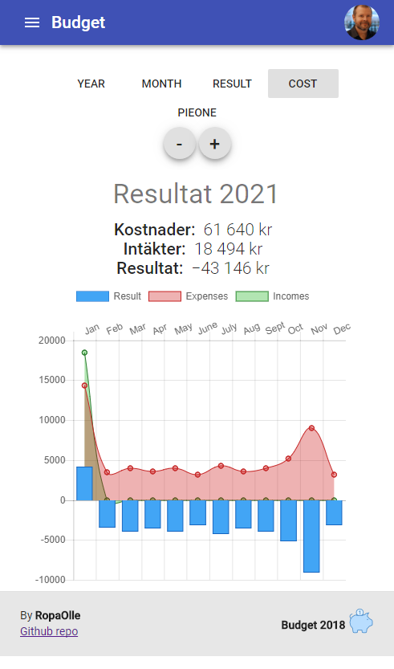
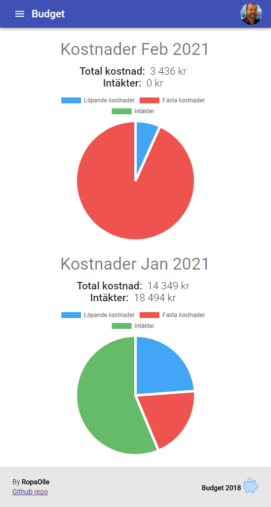

Budget app that graphically displays your expenses and incomes in charts with [Chart.js]( http://www.chartjs.org/). The application is built with React, Redux and uses Firebase Authentication and Firebase Firestore.

# Todo
* [ ] Import fixed costs.
* [ ] Backup DB to Firebase bucket.
* [ ] Restore DB from Firebase bucket.
* [ ] Firebase Functions: Backup, update statistics and auto insert planned expenses.
* [ ] Översätt till Svenska.

